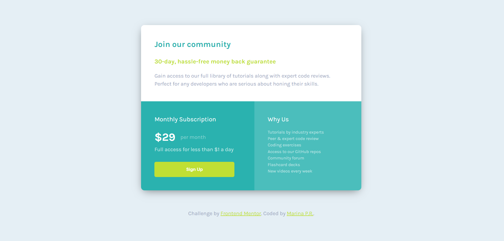

# Frontend Mentor - Single price grid component solution

## Overview

### The challenge

Users should be able to:

- View the optimal layout for the component depending on their device's screen size
- See a hover state on desktop for the Sign Up call-to-action

### Screenshot

### Links

- Solution URL: https://github.com/MarinaPerezR/single-price-grid-component
- Live Site URL: https://effulgent-banoffee-61d247.netlify.app/

## My process

### Built with

- Semantic HTML5 markup
- CSS custom properties
- Flexbox
- CSS Grid
- Mobile-first workflow
